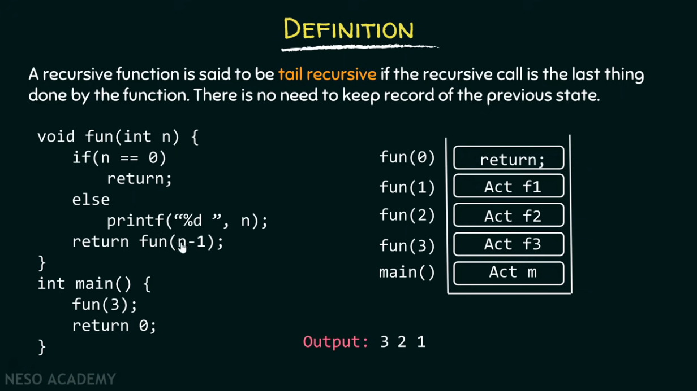
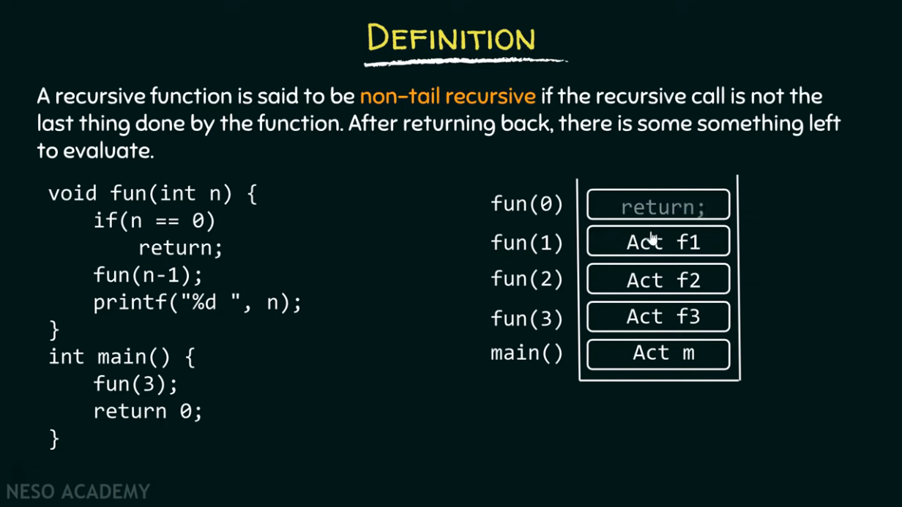

# Recursion and Backtracking

This is prepared with the help of materials from the following sources:

-   [MIT Lecture Notes on Recursion](https://web.mit.edu/6.005/www/fa16/classes/14-recursion/)
-   [Recursion Playlist by TakeUForward](https://www.youtube.com/playlist?list=PLgUwDviBIf0rGlzIn_7rsaR2FQ5e6ZOL9)
-   Some screenshots are from [Neso Academy on Youtube](https://www.youtube.com/c/nesoacademy)

## Introduction and Useful Points

-   Any function which calls itself is called recursive.
-   A recursive method (recursive function) solves a problem by calling a copy of itself. When the call ends, the copy of that returning method is removed from that memory.
-   When a recursive call happens, all the previous function calls keep waiting in the stack memory.
-   Therefore, it's important to terminate a recursive method. Else, there will be a memory overflow.
-   A recursive function calls itself with a slightly better/solved/simpler version of the problem.
-   The smaller problems should terminate or converge on the base case. At the base case, the function encounters a subtask which it can solve without calling itself.

<br>

## Some Examples

#### Print "NAME" n times using recursion.

```java
public class PrintName {
    static void print(int i, int n) {
        if (i > n) return;

        System.out.println("NAME");
        print(i+1, n);

        // Notice the extra parameter 'i'
        // being used to measure the recursive calls.
        // This is called parameterized recursion.
    }

    public static void main(Sting[] args) {
        Scanner sc = new Scanner;
        int n = sc.nextInt(); // take the input for number
        //of times function will run

        print(1, n); // call the function
        //print to print name "n" times.
    }
}
```

#### Print N to 1 using recursion.

```java
public class PrintName {
    static void print(int n) {
        if (n < 1) return;

        System.out.println(n);
        print(n-1);

        // Notice there are no extra parameters
        // in the function call other than 'n'.
        // This is functional recursion.
    }

    public static void main(Sting[] args) {
        Scanner sc = new Scanner;
        int n = sc.nextInt(); // take the input for
        //number of times function will run

        print(n); // call the function print to print
        //n to 1.
    }
}

```

<br>

## Types of Recursion

There are four types of recursion:

1. Direct Recursion
2. Indirect Recursion
3. Tail Recursion
4. Non-Tail Recursion

_For reference please visit [1](https://www.youtube.com/watch?v=t9whckmAEq0), [2](https://www.youtube.com/watch?v=HIt_GPuD7wk)_

**Direct Recursion**

> A function is called direct recursive if it calls the same function again.

**Indirect Recursion**

> A function (say f1) is called indirect recursive if it calls a function f2, which calls f1 directly or indirectly. There can be more than two functions involved in an indirect recursion.

**Tail Recursion**

> A function is called tail recursive, if the recursive call is the last thing done by the function. There is no need to keep record of the previous state.
> 
> Note: In the fun(0) line when function simply returns, the control to fun(1) comes back to last line `return fun(n-1)` after which there is no work to be done. Therefore no record of previous state.
> PS. Stack assumes that there is some work left in fun(1) ... fun(2) that's why it keeps them in record.

**Non-Tail Recursion**

> A function is called tail recursive, if the recursive call is **not** the last thing done by the function. After returning the function call there is some work to evaluate.
> 
> After calling the return on fun(0), control will come back to fun(1) where it'll evaluate the lines `printf("%d", n);`

Note: **Important Example of a Non-tail Recursive Function**

```C

int fun(int n) {
    if (n == 1)
        return;
    else
        return 1+fun(n/2);
}

int main() {
    printf("%d", fun(8));
    return 0;
}
```

This is a non-tail recursive function as in the else statement, `1+fun(n/2)` 1+ needs to be evaluated. Therefore, keep tracking of pending calculations.

<br>

## Recursive functions with multiple recursive calls.

Let's take the classical example of Fibonacci series.
_For reference [read here](https://www.inf.unibz.it/~calvanese/teaching/04-05-ip/lecture-notes/uni10/node23.html)_

```Java
public static long fib(long n) {
  if (n < 0) return -1;  // F(n) is not defined when n is negative
  if (n == 0)
    return 0;
  else if (n == 1)
    return 1;
  else
    return fib(n-2) + fib(n-1);
}

```

It's recursive tree would look like (for fib(6)):

> 
> For multiple recursion calls, which comes first is calculated and returned, and then when the control comes to the original function (which initiated the calls[not main]). Then it calls the next recursion and so on ...
> Note. tree first operates on n-2 then calls n-1. As in the code and the image.

_For more read these: [1](https://www.quora.com/How-do-functions-with-two-recursive-calls-work), [2](https://stackoverflow.com/questions/29312260/difficulty-understanding-multiple-recursive-calls), [3]()_

<br>

## Recursion on subsequences

**Printing subsequences**

Subsequences are part of the array that have the same sequence as the original array. An empty array can also be a subsequence. In mathematics, a subsequence of a given sequence is a sequence that can be derived from the given sequence by deleting some or no elements without changing the order of the remaining elements.

E.g.

```
[3, 1, 2, 7, 0] is an Array (or sequence)

It's subsequence can be:
[3, 1, 2], [1, 2, 0], [7], [3, 0] ...

What subsequence cannot be:
[1, 2, 3], [0, 7, 1]... any change in order is not a subsequence.
```

In order to generate all subsequences, one can use the [power set algorithm](https://www.geeksforgeeks.org/power-set/) to do so.

So, recursion on subsequences requires multiple recursive calls. And to print all the subsequences, we'll try to adopt a `take` vs. `not-take` approach for each element in an array.

Take the following piece of code for e.g.

```Java
public class MyClass {
    public static void printSubs(int[] arr, int index, ArrayList<Integer> ds ) {
        if (index == arr.length) {
            if (ds.size() > 0) {
                System.out.println(ds);
            }
            return;
        }
        // the condition to take an
        // element from the main sequence
        ds.add(arr[index]);
        printSubs(arr, index + 1, ds);
        ds.remove(ds.size() - 1);

        // the condition to not take an
        // element for the main sequence.
        printSubs(arr, index + 1, ds);
    }

    public static void main(Sting[] args) {
        int[] arr = {3, 1, 2, 4};
        ArrayList<Integer> ds = new ArrayList<>();
        printSubs(arr, 0, ds);
    }
}
```

In the similar manner we can have print single element, and count all elements whose sum is equal to that particular sum.

The pattern remains the same. And it's going to be very useful in Dynamic Programming.e
